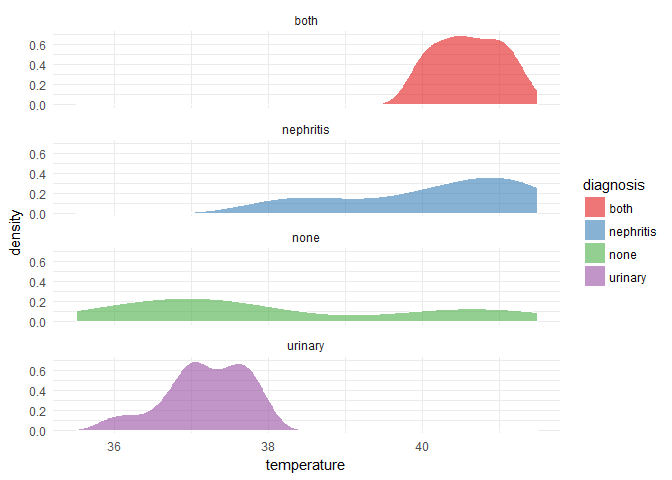
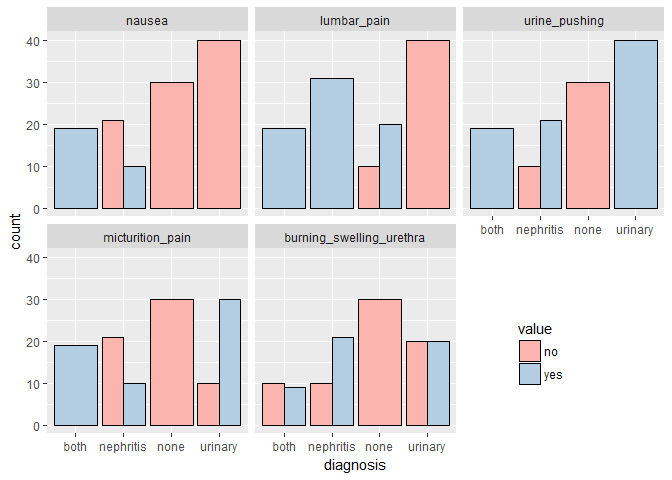
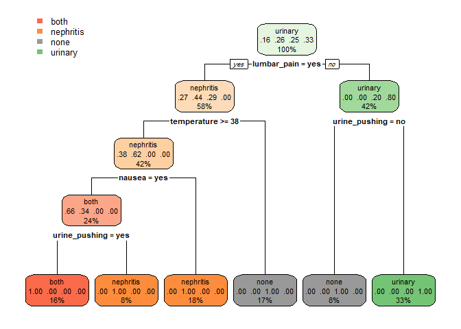

Creating API for Machine Learing Model
================

Creating an API for a Machine Learning Model with R
---------------------------------------------------

#### why an API ?!

APIs allow machine learning models to be implemented in many different ways in production connecting the model and its results with so many apps in the whole system. **also APIs allow the model to speak to other languages** so we can benefit from every language in the field in which it succeeds. as we're going to see now, a model developed in **R** and used from within **Python** and **Command Line**

we'll be using the acute inflammations dataset downloaded from <https://archive.ics.uci.edu/ml/machine-learning-databases/acute/> the dataset is about patients with some symptoms and the goal is to predict whether the patient suffer from Acute inflammation of urinary bladder or acute nephritises.

##### Data Preparation

``` r
data <- read.table('diagnosis.data', fileEncoding="UTF-16", dec=",")
names(data) <- c('temperature', 'nausea', 'lumbar_pain',
                 'urine_pushing', 'micturition_pain', 
                 'burning_swelling_urethra', 'd1', 'd2')

diagnosis <- factor(ifelse(
  data$d1 == 'no' & data$d2 == 'no', 'none', 
  ifelse(data$d2 == 'yes' & data$d1 == 'yes', 'both',
         ifelse(data$d1 == 'yes' & data$d2 == 'no',
                'urinary', 'nephritis'))))

data$diagnosis <- diagnosis
data <- data[, -c(7:8)]
head(data)
```

    ##   temperature nausea lumbar_pain urine_pushing micturition_pain
    ## 1        35.5     no         yes            no               no
    ## 2        35.9     no          no           yes              yes
    ## 3        35.9     no         yes            no               no
    ## 4        36.0     no          no           yes              yes
    ## 5        36.0     no         yes            no               no
    ## 6        36.0     no         yes            no               no
    ##   burning_swelling_urethra diagnosis
    ## 1                       no      none
    ## 2                      yes   urinary
    ## 3                       no      none
    ## 4                      yes   urinary
    ## 5                       no      none
    ## 6                       no      none

``` r
str(data)
```

    ## 'data.frame':    120 obs. of  7 variables:
    ##  $ temperature             : num  35.5 35.9 35.9 36 36 36 36.2 36.2 36.3 36.6 ...
    ##  $ nausea                  : Factor w/ 2 levels "no","yes": 1 1 1 1 1 1 1 1 1 1 ...
    ##  $ lumbar_pain             : Factor w/ 2 levels "no","yes": 2 1 2 1 2 2 1 2 1 1 ...
    ##  $ urine_pushing           : Factor w/ 2 levels "no","yes": 1 2 1 2 1 1 2 1 2 2 ...
    ##  $ micturition_pain        : Factor w/ 2 levels "no","yes": 1 2 1 2 1 1 2 1 2 2 ...
    ##  $ burning_swelling_urethra: Factor w/ 2 levels "no","yes": 1 2 1 2 1 1 2 1 2 2 ...
    ##  $ diagnosis               : Factor w/ 4 levels "both","nephritis",..: 3 4 3 4 3 3 4 3 4 4 ...

##### Exploring the data visually

``` r
library(reshape)
library(ggplot2)
ggplot(data, aes(x = temperature, fill = diagnosis)) + 
  geom_density(alpha = 0.6, color = 'white', size = 0.5) +
  scale_fill_brewer(palette = 'Set1') +
  theme_minimal() +
  facet_wrap(~ diagnosis, ncol = 1)
```



``` r
melted <- melt(data[, -1], id.vars = 'diagnosis')
ggplot(melted, aes(x = diagnosis, fill = value)) + 
  geom_bar(position = 'dodge', color = 'black') + 
  facet_wrap(~ variable) + 
  scale_fill_brewer(palette = 'Pastel1') + 
  theme(legend.position = c(0.8, 0.2)) 
```



now as we have an idea of the data in our hands, let's fit the model. we'll fit a **decision tree** model.

``` r
library(rpart)
library(rpart.plot)
tree_model <- rpart(diagnosis ~ ., data = data)
tree_pred <- predict(tree_model, newdata = data, type = 'class')
## measuring model accuracy
mean(tree_pred == data$diagnosis)
```

    ## [1] 1

``` r
## plotting the model
rpart.plot(tree_model)
```

 our model is such a great one.

let's create the **API** using the **plumber** package first we save the model to load it later in the script of the API.

``` r
save(tree_model, file = 'tree_model.RData')
```

now we write an R script for the API naming it **tree\_api.R**.

``` r
library(jsonlite)
library(plumber)
## load the model
load('tree_model.RData')

## writing a POST request, we can write get request with the same syntax

#* @post /diagnose
diagnose <- function(
  temperature, nausea, lumbar_pain, urine_pushing,
  micturition_pain, burning_swelling_urethra) {
  data <- list(
    temperature = temperature, nausea = nausea,
    lumbar_pain = lumbar_pain, urine_pushing = urine_pushing,
    micturition_pain = micturition_pain,
    burning_swelling_urethra = burning_swelling_urethra
  )
  diagnosis <- predict(tree_model, data, type = 'class')
  d = unbox(toJSON(data.frame(diagnosis)))
  lst <- list(diagnosis = d)
  return(lst)
}
```

now we have everything done. let's experiment it.

``` r
library(plumber)
r <- plumb('tree_api.R')
r$run(port = 8080)
```

now we have the API running on port 8080. let's call it from within **python**

``` python
import json
import requests
import pandas as pd
import ast  
## new data
data = {"temperature" : [36, 35, 35.9, 37],
        "nausea": ['yes', 'no', 'no', 'yes'],
        "lumbar_pain": ['no', 'yes', 'yes', 'no'],
        "urine_pushing": ['no', 'no', 'yes', 'yes'],
        "micturition_pain": ['no', 'yes', 'yes', 'no'],
        'burning_swelling_urethra': ['yes', 'no', 'yes', 'yes']}
data = json.dumps(data)
## writing the data to disk to use it later with command line
with open('data.txt', 'w') as f:
    json.dump(ast.literal_eval(data), f)
headers = {'content-type': 'application/json'}
url = 'http://localhost:8080/diagnose'
r = requests.post(url, data = data, headers = headers)
d = json.loads(r.content)
result = ast.literal_eval(d['diagnosis'])
result
## converting it to pandas DataFrame to further analysis
pd.DataFrame(result)

## [{'diagnosis': 'none'},
## {'diagnosis': 'none'},
## {'diagnosis': 'none'},
## {'diagnosis': 'urinary'}]

##   diagnosis
## 0      none
## 1      none
## 2      none
## 3   urinary
```

well, it works fine. now we have a model implemented with R and its results can be used with python.

let's experiment it with the command line.

``` bash
curl -X POST localhost:8080/diagnose \ 
-d @data.txt -H 'Content:Type: application/json'

## {"diagnosis":
##    "[{"diagnosis":"none"},{"diagnosis":"none"},
##    {"diagnosis":"none"},{"diagnosis":"urinary"}]"}
```

### our model is working fine from everywhere else not only R where it was implemented.

### we can connect the model with whatever application so easily now.

N.B. many forms can be returned using **plumber** but I prefer a dictionary of dictionaries because it makes more sense to have a name for the whole data especially when the data sent and returned are of many variables.
